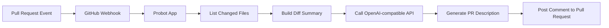

# pr-scribe-ai


[中文说明 / Chinese Version](./README.zh-CN.md)

**Generate clear, structured PR descriptions automatically.**

`pr-scribe-ai` is a GitHub App that turns pull request activity into polished AI-generated summaries and posts them back as PR comments.

## Highlights

- Handles `opened`, `synchronize`, and `reopened` pull request events
- Builds concise PR summaries from changed files
- Supports OpenAI and OpenAI-compatible API providers
- Publishes results as PR comments instead of overwriting the PR body

## Why This Project

Writing pull request descriptions is repetitive, easy to postpone, and often inconsistent across contributors.

This project helps teams and individual developers:

- turn file changes into a readable summary automatically
- standardize PR communication with a consistent structure
- reduce the time spent writing repetitive change descriptions
- plug into any OpenAI-compatible API instead of being tied to a single provider

## Features

- Triggers on `pull_request.opened`, `pull_request.synchronize`, and `pull_request.reopened`
- Fetches changed files from GitHub and builds a lightweight diff summary
- Generates structured output with `Summary`, `Key Changes`, and `Testing Suggestions`
- Posts the generated result as a PR comment instead of overwriting the PR body
- Supports `OPENAI_API_KEY`, `OPENAI_BASE_URL`, and `OPENAI_MODEL`
- Works with OpenAI or any OpenAI-compatible API endpoint

## How It Works



**Flow overview**

1. A PR event is triggered on GitHub.
2. GitHub sends a webhook to the Probot app.
3. The app loads the changed file list for the PR.
4. A concise diff summary is constructed as prompt input.
5. An OpenAI-compatible model generates the PR description.
6. The result is posted back to the PR as a comment.

## Quick Start

This section is intentionally minimal. It gets the app running first. Full GitHub App and local webhook setup details appear later in this README.

### 1. Install dependencies

```sh
npm install
```

### 2. Create `.env`

Copy `.env.example` and fill in the required values:

```sh
cp .env.example .env
```

Minimum example:

```dotenv
APP_ID=
WEBHOOK_SECRET=development
PRIVATE_KEY=
OPENAI_API_KEY=
OPENAI_BASE_URL=
OPENAI_MODEL=gpt-4.1-mini
```

### 3. Start the app

```sh
npm start
```

### 4. Install the GitHub App to a target repository

The app must be installed on the repository where you want PR events to trigger the workflow. If the app is not installed, GitHub will not deliver pull request events to it.

## Configuration

### Core GitHub App settings

| Variable | Required | Description |
| --- | --- | --- |
| `APP_ID` | Yes | The GitHub App ID. |
| `WEBHOOK_SECRET` | Yes | Secret used by GitHub to sign webhook payloads. |
| `PRIVATE_KEY` | Yes | Your GitHub App private key content in PEM format. |

### Model settings

| Variable | Required | Description |
| --- | --- | --- |
| `OPENAI_API_KEY` | Yes | API key for OpenAI or any OpenAI-compatible provider. |
| `OPENAI_BASE_URL` | No | Custom base URL for OpenAI-compatible endpoints. Leave empty to use the official OpenAI default. |
| `OPENAI_MODEL` | No | Model name. Defaults to `gpt-4.1-mini`. |

### Local development settings

| Variable | Required | Description |
| --- | --- | --- |
| `WEBHOOK_PROXY_URL` | Local only | Smee channel URL used to forward GitHub webhooks to your local machine. |
| `LOG_LEVEL` | No | Probot log level, for example `debug`, `info`, or `trace`. |

### Notes

- `PRIVATE_KEY` should be the actual PEM content, not a file path.
- `OPENAI_BASE_URL` can point to providers such as OpenAI-compatible gateways.
- If your provider requires a specific model name, make sure `OPENAI_MODEL` matches the provider's supported models.

## GitHub App Setup

### Recommended repository permissions

Set these permissions in your GitHub App settings:

| Permission | Recommended value | Why |
| --- | --- | --- |
| `Pull requests` | `Read-only` | Required to read PR metadata and changed files. |
| `Issues` | `Read & write` | Required to publish the generated PR comment. |
| `Metadata` | `Read-only` | Standard access for repository metadata. |

### Required events

Subscribe to:

- `Pull request`

This app currently handles:

- `opened`
- `synchronize`
- `reopened`

### Important note about `app.yml`

`app.yml` is a manifest template. Updating it does **not** automatically update an already-created GitHub App.

After changing App permissions or subscribed events, update them in the GitHub App settings page on GitHub as well.

### Installation checklist

- Create or open your GitHub App
- Configure repository permissions
- Subscribe to the `Pull request` event
- Generate a private key
- Install the app on the target repository

## Example Output

Below is a simplified example of the PR comment generated by the app:

```md
🤖 **AI 自动生成的 PR 描述** (仅供参考)

### Summary
This change introduces a GitHub App workflow for automatically generating PR descriptions.

### Key Changes
- Handle pull request webhooks with Probot
- Fetch changed files and build a concise summary
- Call an OpenAI-compatible API to generate the description
- Post the result back to the pull request as a comment

### Testing Suggestions
- Open a new pull request and confirm a comment is generated
- Push new commits to an existing pull request and confirm `synchronize` is triggered
- Reopen a closed pull request and confirm `reopened` is triggered
```

## Development

### Run locally

```sh
npm install
npm start
```

### Run tests

```sh
npm test
```

### Local webhook debugging with Smee

If you are developing locally, use [smee.io](https://smee.io/) to forward GitHub webhooks to your machine.

1. Create a new Smee channel
2. Put the channel URL into `WEBHOOK_PROXY_URL`
3. Start the app with `npm start`
4. Make sure the forwarding target points to:

```text
http://127.0.0.1:3000/api/github/webhooks
```

If port `3000` is occupied, start Probot on another port and update the forwarding target accordingly.

### Useful commands

```sh
# install dependencies
npm install

# run the app
npm start

# run tests
npm test
```

## FAQ / Troubleshooting

### The terminal shows `POST /api/github/webhooks 200`, but no app log appears

This usually means the webhook reached Probot, but the event action did not match the actions handled by the app.

Check whether the event was:

- `pull_request.opened`
- `pull_request.synchronize`
- `pull_request.reopened`

### The app does not receive PR events at all

Check the following:

- the GitHub App is installed on the target repository
- the app subscribes to the `Pull request` event
- your webhook forwarding chain is working
- the local Probot server is actually running
- the target port is not occupied by another process

### `PRIVATE_KEY` is not working

Make sure:

- it matches the current `APP_ID`
- it is the PEM content, not a file path
- the key has not been rotated without updating `.env`

### The model call fails

Check:

- `OPENAI_API_KEY` is valid
- `OPENAI_BASE_URL` points to a compatible endpoint
- `OPENAI_MODEL` is supported by your provider

### Why doesn't updating `app.yml` change the live GitHub App?

Because `app.yml` only acts as a manifest template. Existing GitHub Apps must be updated manually in GitHub settings.

## Contributing

Issues and pull requests are welcome. If you want to improve the app, fix bugs, or refine the PR generation workflow, feel free to open an issue or submit a PR.

For contribution guidelines, see [CONTRIBUTING.md](CONTRIBUTING.md).

## License

[ISC](LICENSE) © 2026 YoungZeus666

