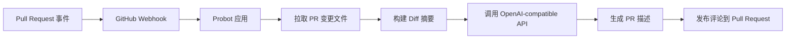

# pr-scribe-ai


[English Version](./README.md)

**自动生成清晰、结构化的 PR 描述。**

`pr-scribe-ai` 是一个 GitHub App，会在 Pull Request 打开、更新或重新打开时，自动生成结构化描述，并以评论形式回写到当前 PR。

## 亮点

- 支持 `opened`、`synchronize`、`reopened` 三类 PR 事件
- 根据变更文件自动生成简洁的 PR 摘要
- 支持 OpenAI 和各类 OpenAI-compatible API
- 以 PR 评论形式发布结果，不直接覆盖 PR 正文

## 项目价值

手写 PR 描述这件事重复、琐碎，而且很容易被拖到最后，最终导致团队里的 PR 质量参差不齐。

这个项目适合团队和个人开发者用来：

- 自动把代码变更整理成更易读的摘要
- 用统一结构提升 PR 沟通质量
- 减少重复编写变更说明的时间成本
- 通过 OpenAI-compatible API 接入不同模型服务，而不是绑定单一厂商

## 功能特性

- 监听 `pull_request.opened`、`pull_request.synchronize` 和 `pull_request.reopened`
- 从 GitHub 拉取变更文件，并构建轻量 diff 摘要
- 生成结构化输出，包含：
  - `变更概述`
  - `主要修改点`
  - `测试建议`
- 以 PR 评论形式发布结果，而不是直接覆盖 PR 正文
- 支持 `OPENAI_API_KEY`、`OPENAI_BASE_URL`、`OPENAI_MODEL`
- 可接 OpenAI 或任意 OpenAI-compatible API 服务

## 工作流程



**流程说明**

1. GitHub 上发生 PR 事件。
2. GitHub 把 webhook 发给 Probot 应用。
3. 应用读取该 PR 的变更文件列表。
4. 应用构建简洁的 diff 摘要作为 prompt 输入。
5. OpenAI-compatible 模型生成 PR 描述。
6. 结果作为评论回写到当前 PR。

## 快速开始

这一节故意保持最短路径，先帮助你把应用跑起来。更完整的 GitHub App 配置、本地 webhook 调试说明，放在后面的章节。

### 1. 安装依赖

```sh
npm install
```

### 2. 创建 `.env`

复制 `.env.example`，并填写必要配置：

```sh
cp .env.example .env
```

最小示例：

```dotenv
APP_ID=
WEBHOOK_SECRET=development
PRIVATE_KEY=
OPENAI_API_KEY=
OPENAI_BASE_URL=
OPENAI_MODEL=gpt-4.1-mini
```

### 3. 启动应用

```sh
npm start
```

### 4. 把 GitHub App 安装到目标仓库

这个应用必须安装到你希望触发 PR 自动描述流程的仓库上。  
如果 App 没有安装到目标仓库，GitHub 不会把 Pull Request 事件投递给它。

## 配置说明

### GitHub App 核心配置

| 变量 | 必填 | 说明 |
| --- | --- | --- |
| `APP_ID` | 是 | GitHub App 的 ID。 |
| `WEBHOOK_SECRET` | 是 | GitHub 用来签名 webhook 的密钥。 |
| `PRIVATE_KEY` | 是 | GitHub App 私钥 PEM 内容。 |

### 模型配置

| 变量 | 必填 | 说明 |
| --- | --- | --- |
| `OPENAI_API_KEY` | 是 | OpenAI 或兼容服务的 API Key。 |
| `OPENAI_BASE_URL` | 否 | OpenAI-compatible 接口地址；留空时默认走官方 OpenAI 地址。 |
| `OPENAI_MODEL` | 否 | 模型名，默认是 `gpt-4.1-mini`。 |

### 本地开发配置

| 变量 | 必填 | 说明 |
| --- | --- | --- |
| `WEBHOOK_PROXY_URL` | 仅本地开发 | Smee 通道地址，用于把 GitHub webhook 转发到本机。 |
| `LOG_LEVEL` | 否 | Probot 日志级别，比如 `debug`、`info`、`trace`。 |

### 注意事项

- `PRIVATE_KEY` 需要填写 PEM 内容本身，不是文件路径。
- `OPENAI_BASE_URL` 可以指向任意 OpenAI-compatible 网关。
- 如果你使用的是兼容服务，`OPENAI_MODEL` 必须与该服务支持的模型名一致。

## GitHub App 设置

### 推荐的仓库权限

建议在 GitHub App 设置中启用以下权限：

| 权限 | 推荐值 | 作用 |
| --- | --- | --- |
| `Pull requests` | `Read-only` | 用于读取 PR 元数据和变更文件。 |
| `Issues` | `Read & write` | 用于发布自动生成的 PR 评论。 |
| `Metadata` | `Read-only` | 用于访问仓库基础元数据。 |

### 必需订阅的事件

请订阅：

- `Pull request`

当前应用实际处理的动作有：

- `opened`
- `synchronize`
- `reopened`

### 关于 `app.yml`

`app.yml` 只是一个 manifest 模板文件。修改它 **不会** 自动更新已经创建好的 GitHub App。

如果你修改了权限或事件订阅，还需要到 GitHub App 后台手动同步配置。

### 安装检查清单

- 创建或打开你的 GitHub App
- 配置仓库权限
- 订阅 `Pull request` 事件
- 生成私钥
- 把 App 安装到目标仓库

## 示例输出

下面是一个简化后的 PR 评论示例：

```md
🤖 **AI 自动生成的 PR 描述** (仅供参考)

### 变更概述
本次变更为仓库新增了自动生成 PR 描述的 GitHub App 工作流。

### 主要修改点
- 接入 Probot 处理 Pull Request webhook
- 拉取变更文件并生成摘要
- 调用 OpenAI-compatible API 生成描述内容
- 将结果作为评论发布到 Pull Request

### 测试建议
- 新建一个 Pull Request，确认会自动生成评论
- 对现有 Pull Request push 新提交，确认 `synchronize` 事件可触发
- 关闭后重新打开 Pull Request，确认 `reopened` 事件可触发
```

## 开发说明

### 本地运行

```sh
npm install
npm start
```

### 运行测试

```sh
npm test
```

### 使用 Smee 调试本地 webhook

如果你是在本地开发，推荐用 [smee.io](https://smee.io/) 把 GitHub webhook 转发到你的电脑。

1. 创建一个新的 Smee channel
2. 把 channel URL 填到 `WEBHOOK_PROXY_URL`
3. 执行 `npm start`
4. 确认转发目标是：

```text
http://127.0.0.1:3000/api/github/webhooks
```

如果 `3000` 端口被占用，就换一个端口启动 Probot，并同步修改 Smee 的转发目标。

### 常用命令

```sh
# 安装依赖
npm install

# 启动应用
npm start

# 运行测试
npm test
```

## FAQ / 排障

### 终端里看到 `POST /api/github/webhooks 200`，但没有业务日志

这通常表示 webhook 已经到达 Probot，但事件动作没有命中当前应用监听的 action。

请检查触发的是否是：

- `pull_request.opened`
- `pull_request.synchronize`
- `pull_request.reopened`

### 应用完全收不到 PR 事件

请优先检查：

- GitHub App 是否已经安装到目标仓库
- GitHub App 是否订阅了 `Pull request` 事件
- webhook 转发链路是否正常
- 本地 Probot 服务是否真的启动成功
- 本地目标端口是否被其他进程占用

### `PRIVATE_KEY` 配置不生效

请确认：

- 它和当前 `APP_ID` 是同一个 GitHub App
- 填的是 PEM 内容，不是文件路径
- 私钥是否被重新生成过，但 `.env` 没有同步更新

### 模型调用失败

请检查：

- `OPENAI_API_KEY` 是否有效
- `OPENAI_BASE_URL` 是否指向兼容接口
- `OPENAI_MODEL` 是否是该服务支持的模型名

### 为什么改了 `app.yml`，线上 GitHub App 没变化

因为 `app.yml` 只是初始化模板。已经创建好的 GitHub App 需要你去 GitHub 设置页手动修改。

## 参与贡献

欢迎提 Issue 和 Pull Request。

如果你想改进这个项目、修复 Bug，或者继续完善 PR 自动生成工作流，欢迎直接参与。

具体贡献规范见 [CONTRIBUTING.md](CONTRIBUTING.md)。

## License

[ISC](LICENSE) © 2026 YoungZeus666
